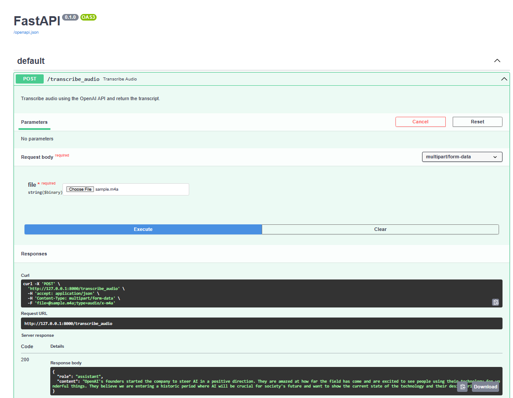

# Audio to Summarised Text with OpenAI

## Objectives
The objective of this project is to create a Python application using FastAPI that can transcribe audio files into text using the Whisper-1 model, and then use the GPT-3.5 Turbo model to summarize the transcribed text.

## Goals
The primary goal of this project is to provide a proof of concept for a tool that can be used during team meetings to automatically transcribe and summarize discussions. This can save valuable time by eliminating the need for manual note-taking and post-processing of meeting records. The tool will be easy to use, reliable, and accurate, allowing teams to focus on productive discussions rather than administrative tasks. With this application, meetings can be more efficient and productive, and important insights and decisions can be easily captured and shared.

### Commands
- To run application, 
 type "uvicorn audio2textsum:app --reload"

### Sample Result

Sample audio file (m4a) [sample.m4a](audio/sample.m4a)

Using OpenAI Whisper API, transcript audio file to text as

{
  "text": "We started OpenAI seven years ago because we felt like something really interesting was happening in AI. We wanted to help steer it in a positive direction. It's honestly just really amazing to see how far this whole field has come since then. And it's really gratifying to hear from people like Raymond who are using technology we are building and others for so many wonderful things. We hear from people who are excited, we hear from people who are concerned, we hear from people who feel both those emotions at once. And honestly, that's how we feel. Above all, it feels like we're entering a historic period right now where we as a world are going to define a technology that will be so important for our society going forward. And I believe that we can manage this for good. So today I want to show you the current state of that technology and some of the underlying design principles that we hold dear."
}

Then using OpenAI gpt-3.5-turbo, summarised text as 

Summary: {
  "content": "OpenAI's founders started the company to steer AI in a positive direction. They are amazed at how far the field has come and are excited to see people using their technology for wonderful things. They believe we are entering a historic period where AI will be crucial for society's future and want to show the current state of the technology and their design principles.",
  "role": "assistant"
}

Using FastAPI as interface

