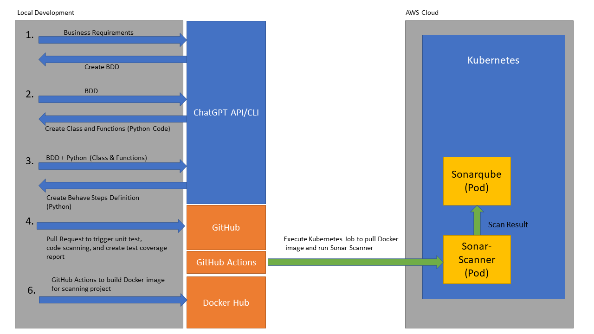
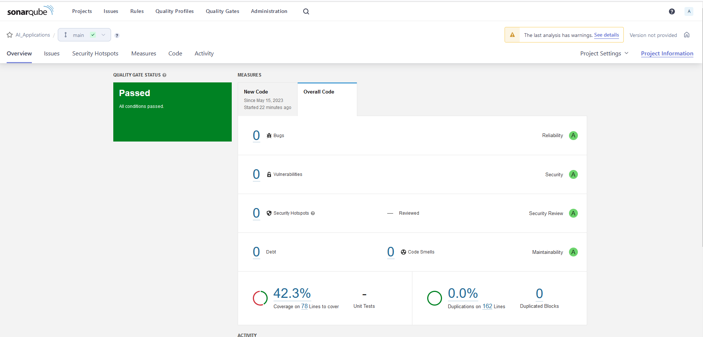

# Test Automation with AI

## Goals of Project

The main goal of this project is to implement test automation with Artificial Intelligence (AI) to improve test coverage and accuracy. By utilizing AI, we aim to reduce manual effort required for testing and ensure that our test cases are executed with a high degree of precision.

## Test Automation Technology Implementation

We will be using OpenAI's ChatGPT, a large language model for natural language processing and generation to implement test automation with AI. The test automation will follow the Behavior-Driven Development (BDD) approach and be implemented using the Python programming language.

We will use Behave to translate our Gherkin syntax into executable code. Gherkin syntax allows us to describe test scenarios in plain English and provides a common language for all stakeholders involved in the development process. Behave, on the other hand, allows us to map these scenarios to Python code and run them as automated tests.

By leveraging AI, BDD, and Python-based test automation frameworks, we can ensure that our test automation is efficient, accurate, and maintains high code quality. The use of AI in test automation brings significant benefits, including reduced manual effort, faster feedback loops, and increased test coverage.

## Limitations

While ChatGPT can be used to generate BDD automatically, there are certain limitations to consider:

Lack of Consistency: One significant limitation is the challenge in maintaining consistency of outputs. Each run of the model may generate BDDs in different styles or formats. This inconsistency can make it difficult to rely solely on automated BDD generation without human intervention.

Contextual Understanding: ChatGPT's understanding of the context and specific domain knowledge may be limited. It may not fully grasp the intricacies and nuances of the business requirements or industry-specific terminology, leading to potential inaccuracies or incomplete BDDs.

Complex Scenarios: Generating BDDs for complex or intricate scenarios that involve multiple conditions, edge cases, or complex business rules may be challenging for an automated system. The model might struggle to accurately capture all the necessary details and produce comprehensive BDDs.

Quality Assurance: While automated BDD generation can minimize human efforts, it still requires thorough quality assurance. Generated BDDs should be carefully reviewed and validated by domain experts to ensure accuracy, completeness, and adherence to the intended specifications.

Model Limitations: The capabilities and limitations of the underlying language model used for BDD generation should be considered. Depending on the model's training data and knowledge cutoff, it may lack awareness of recent developments, specific industry practices, or evolving best practices.

Despite these limitations, automated BDD generation using ChatGPT can still be a valuable tool to assist in the initial creation of BDDs, reduce human effort, and provide a starting point for further refinement and collaboration with domain experts.

## Recommendations

Based on the example provided, the following recommendations can be made:

Limited Integration with CI: It is not recommended to fully integrate ChatGPT with continuous integration (CI) systems due to the inherent uncertainty in its outputs. However, it can be utilized in the development stage to assist developers in generating code and BDDs, which can help speed up the development process. The generated code and BDDs should be reviewed and refined before being committed to the code repository.

Utilize AI in Development Stage: Leverage AI, such as ChatGPT, during the development stage to assist developers in generating initial code and BDDs. This can help accelerate the development process by providing a starting point and reducing the need to write code and BDDs from scratch. However, human intervention and final touch-ups are crucial to ensure the accuracy and quality of the generated artifacts.

Incorporate CI Practices: Once the code and BDDs are generated and refined, leverage CI practices to automate various tasks, such as running unit tests, performing code scanning, and generating test coverage reports. This can be achieved through tools like GitHub Actions, which can be configured to trigger CI processes automatically. This helps maintain code quality, identify issues early on, and ensure the reliability and stability of the software.

Build Pipelines with GitHub Actions: In the example provided, pipelines can be built using GitHub Actions to streamline the software development process. The suggested pipeline steps include building a Docker image and saving it to DockerHub, triggering a Kubernetes job to execute the scanner on Kubernetes infrastructure with AWS Cloud, and storing the scan results in SonarQube. These pipelines can be customized to fit the specific requirements of the project and can be further enhanced with additional stages such as integration testing and deployment to different environments.

By following these recommendations, developers can benefit from the assistance of AI in generating code and BDDs, while still ensuring the reliability and quality of the software through the utilization of CI practices and automated pipelines.

## Tips to improve the performance of ChatGPT

When providing a prompt to ChatGPT or any language model, it's helpful to follow some best practices to receive more accurate and relevant responses. Here are some tips:

Be specific: Clearly specify the information or context you want the model to consider. The more specific and detailed your prompt is, the better the model can understand your request and provide a targeted response.

    Here's an example of how to be specific when providing a prompt to ChatGPT:

    Non-specific prompt:
    "What are the benefits of exercise?"

    Specific prompt:
    "Can you provide five specific benefits of aerobic exercise for cardiovascular health and how it contributes to weight management?"

    In the specific prompt, we clearly mention the number of benefits (five), the type of exercise (aerobic), the aspect we're interested in (cardiovascular health), 
    and the additional information we want (how it contributes to weight management). This helps guide the model to provide a focused and 
    detailed response based on the specific criteria mentioned in the prompt.

Set the format or desired output: If you have a preferred format or type of response in mind, communicate it explicitly in the prompt. For example, if you want a step-by-step guide, a summary, or a comparison, mention it in your instructions.

    Here's an example of how to set the format or desired output when providing a prompt to ChatGPT:

    Without format specification:
    "How can I improve my time management skills?"

    With format specification:
    "Please provide three practical strategies or techniques that can help improve time management skills, along with a brief explanation for each."

    By setting the format or desired output in the prompt, you indicate to the model that you're specifically looking for three strategies or techniques and a brief explanation for each. 
    This helps ensure that the response generated by the model aligns with the requested format, allowing you to receive a more structured and targeted answer.

Use examples: Providing examples can help the model understand the desired output or the style of response you're looking for. You can include sample sentences, snippets, or even completed parts of the desired response.

Specify constraints: If there are any limitations, restrictions, or specific requirements that should be considered in the response, mention them clearly. This helps guide the model's output within the defined boundaries.

Ask for clarification or reasoning: If you want the model to explain its reasoning or provide more detailed insights, explicitly ask for it in the prompt. This can help elicit more informative responses.

Iterate and refine: If the initial response is not satisfactory, you can iterate and refine your prompt. Experiment with different wording, structure, or additional instructions to improve the quality and relevance of the generated response.

