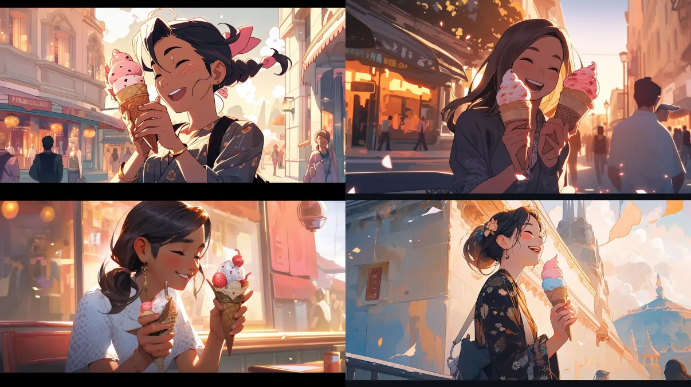

# AI Image Creation

How to fine-tune text description using ChatGPT when creating image like Midjourney

## Instructions

In ChatGPT,
Prompt: describe image with mix image captioning and visual concepts in 100 words for "pretty woman, eat ice-cream, joyful"

Response: In this captivating image, a pretty woman exudes joy as she indulges in the delightful pleasure of eating an ice-cream cone. The vibrant colors and intricate details evoke a distinct Japanese anime style, with the woman's expressive eyes and radiant smile capturing the essence of her happiness. The image portrays a sense of carefree enjoyment, as the woman's stylish attire complements the playful atmosphere. The delectable ice-cream, depicted with enticing textures and vibrant hues, adds a tantalizing element to the scene. It's a moment frozen in time that encapsulates the pure joy of savoring a sweet treat and embracing life's simple pleasures.

In Midjourney,

/imagine prompt In this captivating image, a pretty woman exudes joy as she indulges in the delightful pleasure of eating an ice-cream cone. The vibrant colors and intricate details evoke a distinct Japanese anime style, with the woman's expressive eyes and radiant smile capturing the essence of her happiness. The image portrays a sense of carefree enjoyment, as the woman's stylish attire complements the playful atmosphere. The delectable ice-cream, depicted with enticing textures and vibrant hues, adds a tantalizing element to the scene. It's a moment frozen in time that encapsulates the pure joy of savoring a sweet treat and embracing life's simple pleasures. --niji 5 --style scenic --ar 16:9

