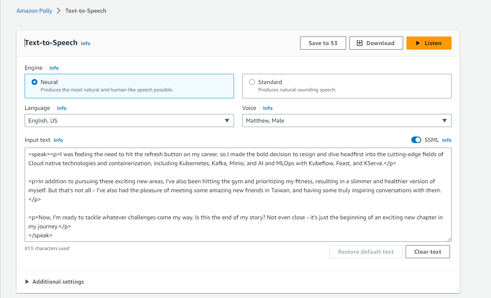

# Create video stills using AI

This project is to create a still video using AI;
- Midjourney: AI image generator
- ChatGPT: We use ChatGPT to enrich our transcripts
- Amazon Polly: convert transcripts to Human-like AI Speech

## Midjourney

Using MidJourney to create different scenes.

### commands
Using /imagine
Type /imagine prompt: or select the /imagine command from the slash commands pop-up.

Type a description of the image you want to create in the prompt field.
Send your message.

For example:
in Discord, /imagine prompt cinematic anime style, an asian study and learn with his laptop --v 5.1 --ar 16:9 --seed 305535136

Then Midjourney will generate 4 images for you;

descriptions: describe your picture "cinematic anime style, an asian study and learn with his laptop"

Parameters: 
--v 5.1: model version 5.1
--ar 16:9: 16:9 view
--seed 305535136: This seed help to generate style of images consistency. Seed is random generated for each of job is executed.

## ChatGPT

You can use free ChatGPT online or use their paid API.

In ChatGPT prompt, type your goal, for example, "Rewrite with better grammar and more vivid speech for my introduction:"

## Amazon Polly

you can use its UI to copy and paste in order to convert text to Speech or use API service.

Finally, use movie editor software integrate them together to form a movie!

[Sample movie](https://www.youtube.com/watch?v=xBCm8oSSlLg)